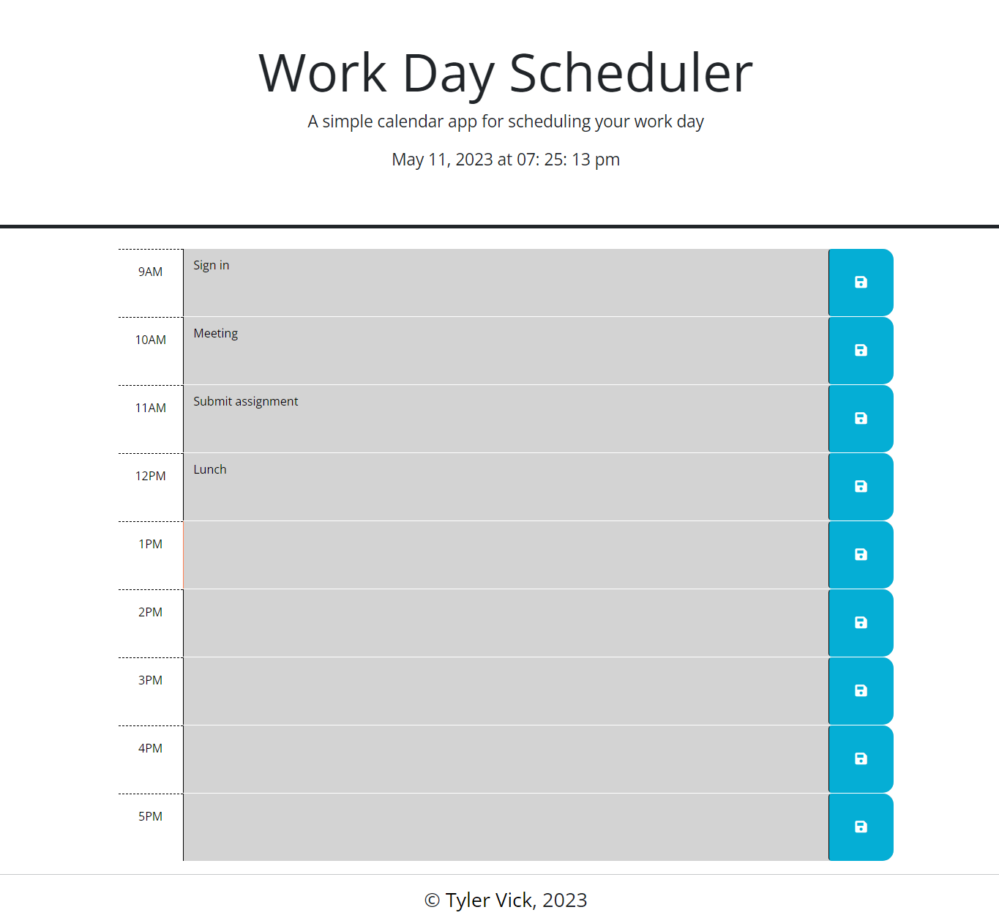

# Work-Day-Scheduler

## Description

The purpose of this repository is to demonstrate third party API use. For example, Dayjs gives the user the ability to display an active clock for current time on their webpage. The reason for building this webpage is to show my knowledge and ability with Third Party APIs, as well as establish more for my portfolio for future when presenting my work to colleagues and potential employers. Understanding things like how jQuery can add function to elements and how backticks work will streamline the process of producing interactive and well functioning sites in the future.

## Installation

N/A

## Usage

The URL of the deployed application: https://jrtvick.github.io/work-day-scheduler/

The URL of the GitHub repository: https://github.com/jrtvick/work-day-scheduler.git

## Credits

Tutorial Links:

https://eloquentjavascript.net/Eloquent_JavaScript_small.pdf

https://www.w3schools.com/js/js_switch.asp

https://day.js.org/docs/en/display/format

https://jqueryui.com/demos/

https://choosealicense.com/licenses/mit/

https://coding-boot-camp.github.io/full-stack/github/professional-readme-guide

## License

MIT License

Copyright (c) 2023 Tyler Vick

Permission is hereby granted, free of charge, to any person obtaining a copy
of this software and associated documentation files (the "Software"), to deal
in the Software without restriction, including without limitation the rights
to use, copy, modify, merge, publish, distribute, sublicense, and/or sell
copies of the Software, and to permit persons to whom the Software is
furnished to do so, subject to the following conditions:

The above copyright notice and this permission notice shall be included in all
copies or substantial portions of the Software.

THE SOFTWARE IS PROVIDED "AS IS", WITHOUT WARRANTY OF ANY KIND, EXPRESS OR
IMPLIED, INCLUDING BUT NOT LIMITED TO THE WARRANTIES OF MERCHANTABILITY,
FITNESS FOR A PARTICULAR PURPOSE AND NONINFRINGEMENT. IN NO EVENT SHALL THE
AUTHORS OR COPYRIGHT HOLDERS BE LIABLE FOR ANY CLAIM, DAMAGES OR OTHER
LIABILITY, WHETHER IN AN ACTION OF CONTRACT, TORT OR OTHERWISE, ARISING FROM,
OUT OF OR IN CONNECTION WITH THE SOFTWARE OR THE USE OR OTHER DEALINGS IN THE
SOFTWARE.

---